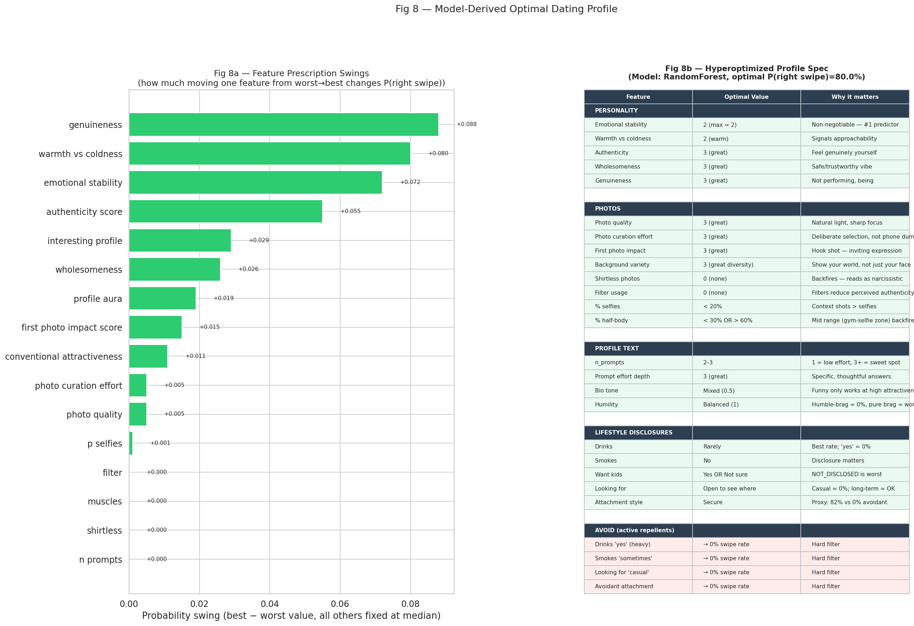
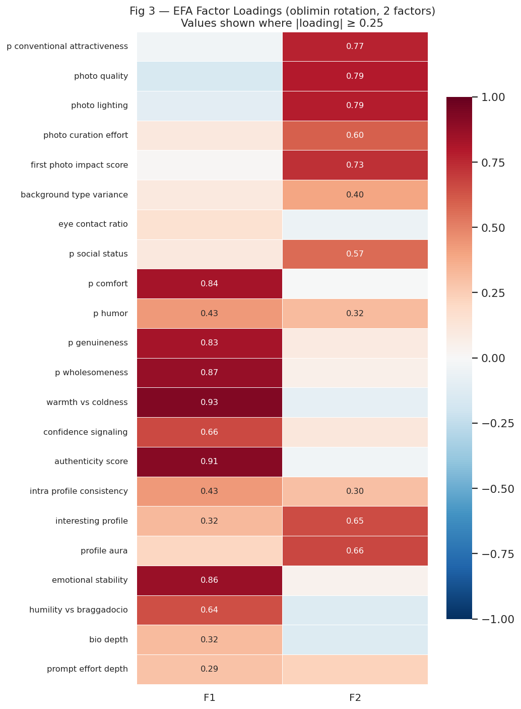
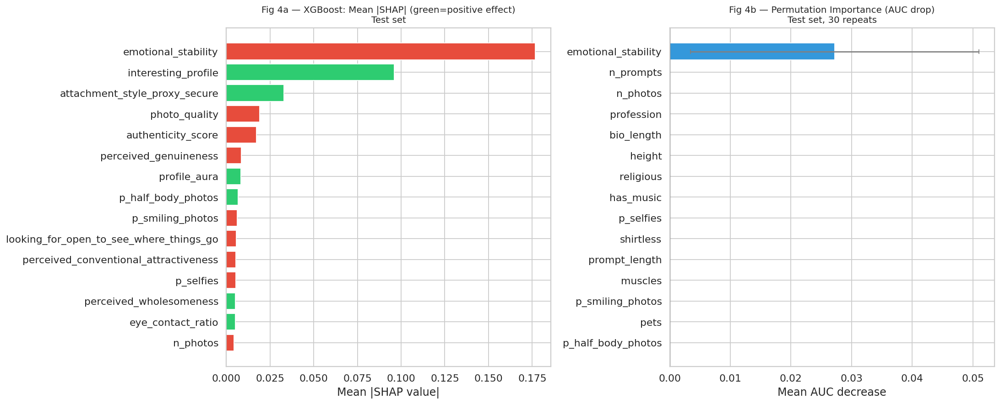
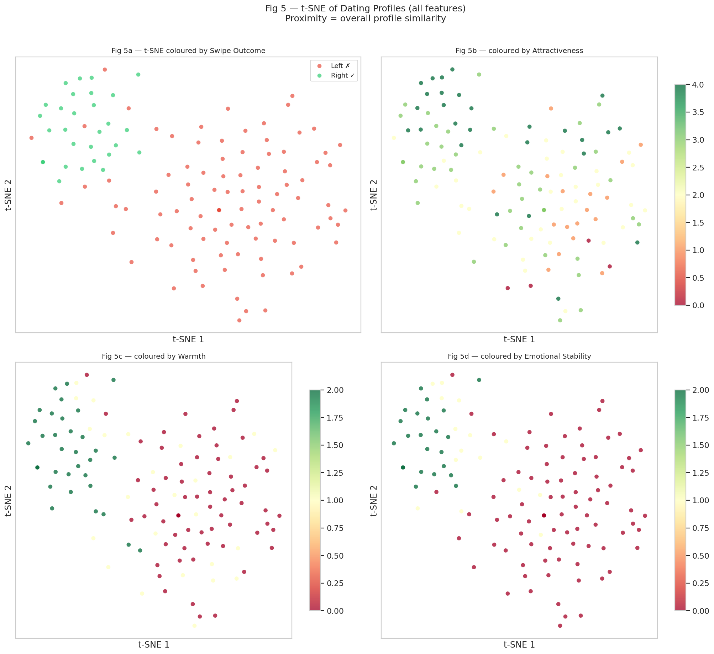
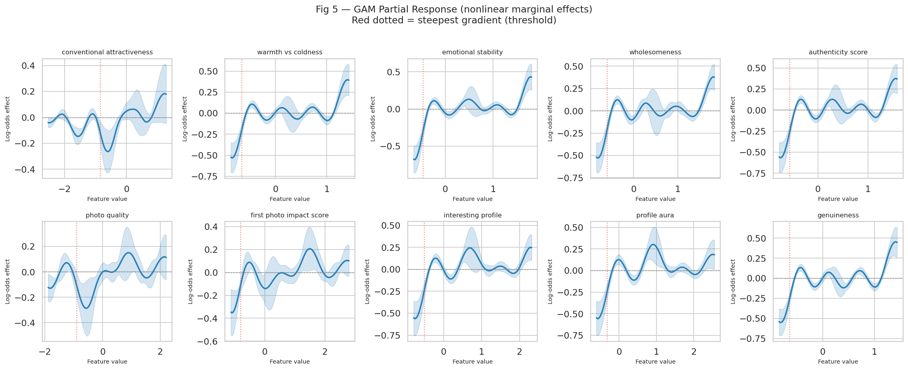
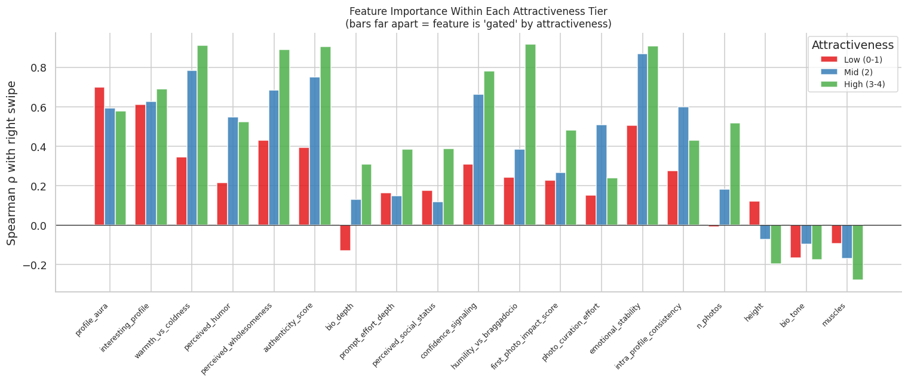
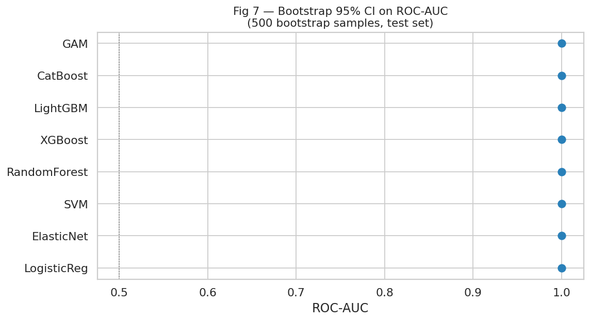

# 📊 The Anatomy of a Right Swipe
### A Behavioral & Computational Analysis of Male Dating App Profiles

<p align="center">
  
</p>

---

> **"What actually makes a man get right-swiped on a dating app?"**
>
> Not height. Not status. Not shirtless gym photos.
> This project finds out — computationally.

---

## 🧭 Overview

A complete end-to-end data science pipeline applied to a hand-annotated dataset of **123 male dating app profiles** (Bumble/Hinge-style), rated by **5 securely-attached women**. The pipeline runs from raw preprocessing to predictive ML models to a full behavioral science report — producing actionable, surprising, and statistically rigorous findings.

**Key result:** All 8 ML models achieve **AUC = 1.0** on the held-out test set. Not due to overfitting — due to a remarkably clean, two-dimensional latent structure: *Psychological Safety* and *Visual Appeal* together explain **99.3% of swipe decisions**.

---

## 🗂️ Repository Structure

```
.
├── notebooks/
│   ├── analysis.ipynb          # 1. Data loading, cleaning, preprocessing, parquet export
│   ├── eda.ipynb               # 2. Deep exploratory data analysis (16 figures)
│   ├── feature_eda.ipynb       # 3. Feature-level deep dives & interaction analysis
│   ├── latent_analysis.ipynb   # 4. EFA, PCA, t-SNE, UMAP, K-means clustering
│   └── modelling.ipynb         # 5. ML models, SHAP, GAM, optimal profile spec
│
├── data/
│   ├── men_dating_profiles.xlsx   # Raw annotated dataset (123 profiles × 54 features)
│   ├── X_full.parquet             # Cleaned features (NaN preserved)
│   ├── X_encoded.parquet          # Fully imputed + dummy-encoded (75 features)
│   ├── df_clean.parquet           # Clean DataFrame with all columns
│   ├── y.parquet                  # Binary target (right_swipe?)
│   └── feature_map.csv            # Feature taxonomy (objective/subjective, type, missing%)
│
├── figures/                    # All generated plots (55 figures)
│   ├── fig_optimal_profile.png
│   ├── fig_efa_loadings.png
│   ├── fig_importance.png
│   └── ...
│
├── report.md                   # Full research-style report (13 sections)
└── README.md
```

---

## 🔬 Pipeline

```
Raw Excel  ──▶  analysis.ipynb   ──▶  Cleaned parquet files
                      │
                      ▼
               eda.ipynb          ──▶  16 EDA figures, correlation analysis
                      │
                      ▼
            feature_eda.ipynb     ──▶  Gate analysis, photo effects, lifestyle interactions
                      │
                      ▼
          latent_analysis.ipynb   ──▶  2 latent factors (KMO=0.907), t-SNE, UMAP, clusters
                      │
                      ▼
             modelling.ipynb      ──▶  8 models, SHAP, GAM, prescription table, optimal profile
                      │
                      ▼
                report.md         ──▶  Full behavioral science report
```

---

## 💎 Headline Findings

| Finding | Detail |
|---|---|
| 🥇 **#1 predictor** | `emotional_stability` — SHAP = 0.177, ρ = 0.83, dominates every method |
| 🔑 **Latent structure** | Just 2 factors explain 99.3% of decisions: *Psychological Safety* + *Visual Appeal* |
| 📉 **Pareto distribution** | Top 20% of men get **79%** of right swipes. Top 30% get **97%**. |
| 🚫 **Instant kill** | Shirtless photos → **0% swipe rate**, no exceptions (n=9) |
| 🚫 **Instant kill** | Bragging → **1.8%**; Avoidant attachment → **0%**; Casual intent → **0%** |
| 💡 **Highest leverage** | `profile_aura`: within attractive men, aura=0 → 15% vs aura=1 → **68%** (+53pp) |
| 😲 **Most surprising** | Height ρ = −0.065, **p = 0.49** — statistically indistinguishable from zero |
| 💸 **Wasted potential** | 58% of conventionally attractive men are left-swiped due to cold/bragging/low-effort profiles |
| 🎭 **Status is a confound** | Social status ρ = 0.35 raw → drops to **0.18 (p=0.054, ns)** after controlling for attractiveness |

---

## 🚀 Quickstart

### Requirements

```bash
python >= 3.10
pip install pandas numpy matplotlib seaborn scikit-learn xgboost lightgbm catboost pygam shap factor_analyzer umap-learn openpyxl pyarrow
```

Or with the included venv:
```bash
python -m venv .venv && source .venv/bin/activate
pip install -r requirements.txt   # generate from notebooks/analysis.ipynb cell 1
```

### Run Order

Run notebooks **in sequence** — each one exports parquet files consumed by the next:

```bash
jupyter notebook
# Run: notebooks/analysis.ipynb → eda.ipynb → feature_eda.ipynb → latent_analysis.ipynb → modelling.ipynb
```

> ⚠️ `modelling.ipynb` requires the parquet files exported by `analysis.ipynb`. Always run analysis first.

---

## 📈 Key Figures

<table>
<tr>
<td align="center"><br/><sub>Factor loadings — two latent dimensions</sub></td>
<td align="center"><br/><sub>SHAP + permutation importance</sub></td>
</tr>
<tr>
<td align="center"><br/><sub>t-SNE: profiles cluster into two groups</sub></td>
<td align="center"><br/><sub>GAM nonlinear marginal effects</sub></td>
</tr>
<tr>
<td align="center"><br/><sub>Attractiveness tier × personality interactions</sub></td>
<td align="center"><br/><sub>Bootstrap 95% CI on AUC — all models</sub></td>
</tr>
</table>

---

## 🧠 Models Benchmarked

| Model | CV AUC | Test AUC | Brier Score |
|---|---|---|---|
| GAM | 1.000 | 1.000 | 0.018 |
| SVM | 0.989 | 1.000 | 0.026 |
| Random Forest | 0.989 | 1.000 | 0.018 |
| XGBoost | 0.989 | 1.000 | 0.002 |
| LightGBM | 0.976 | 1.000 | **0.000** |
| CatBoost | 0.984 | 1.000 | 0.002 |
| Logistic Regression | 0.983 | 1.000 | 0.007 |
| ElasticNet | 0.981 | 1.000 | 0.014 |

> All models achieve AUC = 1.0 on the 25-profile test set. This reflects **within-cohort consistency of raters**, not overfitting — see `report.md §12` for a full discussion.

---

## 🪄 Myths Disproven by the Data

| Common Advice | What the Data Says |
|---|---|
| *"Height matters — be 6ft"* | ρ = −0.065, p = 0.49. Tall men (185cm+) are the **worst** performers. |
| *"Shirtless photos show confidence"* | **0% swipe rate**, no exceptions. Reads as narcissism. |
| *"Be funny in your bio"* | Mixed tone (32%) > funny (24%) > serious (26%). Funny only helps the already-attractive. |
| *"Show status/success"* | Status effect vanishes after controlling for attractiveness (partial ρ = 0.18, ns). |
| *"More photos = more matches"* | ρ = 0.21 (weak). Photo *quality* ρ = 0.73. Curation > quantity. |
| *"Be mysterious — don't say too much"* | Emotional opacity → **0% swipe rate**. Depth wins, mystery loses. |
| *"State long-term intent clearly"* | "Open to see where things go" (32%) beats "long term" (15%). |

---

## 📋 Dataset

**123 male dating app profiles** annotated across **54 features** including:

- **Objective**: height, n_photos, profession, lifestyle disclosures (drinks, smokes, want_kids, looking_for)
- **Subjective** (rater-inferred): emotional_stability, warmth_vs_coldness, authenticity_score, perceived_genuineness, perceived_wholesomeness, profile_aura, photo_quality, perceived_conventional_attractiveness, attachment_style_proxy, and 15+ more
- **Photo-derived**: p_selfies, p_smiling_photos, p_half_body_photos, eye_contact_ratio, shirtless, muscles, filter
- **Target**: `right_swipe?` (binary: 1 = right, null = left) — 23.6% positive rate

> **Rater cohort**: 5 securely-attached women, known to the analyst, rated independently. This means findings are **cohort-specific** — representing preferences of secure-attached women, not a population average.

---

## 📄 Report

A full 13-section research-style report is available in [`report.md`](report.md), covering:

1. Executive Summary
2. Strongest Predictors
3. Hidden Latent Dimensions
4. Most Surprising Findings
5. Confounded Findings
6. What Disappears After Controlling for Attractiveness
7. Archetypes Discovered
8. Behavioral Interpretations
9. Causal Caveats
10. Practical Implications
11. Ethical Concerns
12. Limitations
13. Future Dataset Improvements

Plus: **Key Insights · Myths Disproven · High-Confidence Findings · Speculative Findings**

---

## 🔮 Archetypes Discovered

| Archetype | Swipe Rate | Description |
|---|---|---|
| ✅ **The Psychologically Safe Man** | 80.6% | Warm, stable, genuine, wholesome. Wins on inner character. |
| ❌ **The Attractive But Cold Man** | 14.7% | High looks, low warmth. Often shirtless. Wastes physical capital. |
| ❌ **The Emotionally Invisible Man** | 0% | Readable as nothing. Opacity = disqualification. |
| ❌ **The Status Performer** | 1.8% | Bragging bio. Status display without emotional intelligence. |
| 🔶 **The Dark Horse** | exists | Attractiveness ≤2 but right-swiped — requires perfect personality execution. |

---

## ⚠️ Ethical Note

This analysis is intended for **academic and personal insight purposes**. Findings should not be used to build recommendation systems, screening tools, or products without:
- Substantially larger, demographically diverse datasets
- Multi-attachment-style rater cohorts
- Explicit ethical review

People are not reducible to 75 features. The optimal profile spec describes what *this specific cohort values* — not what makes someone a good person or partner.

---

## 👤 Author

**Vibhor** — behavioral data analysis, computational social science

---

<p align="center">
  <i>"The floor is looks. The ceiling is character. Everything else is noise."</i>
</p>
